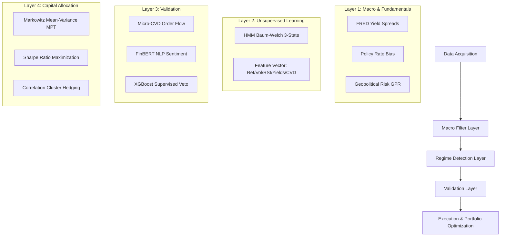

# Institutional HMM Macro-Quant Scanner (Unified 2026 Engine)

A high-sophistication quantitative scanner designed for the structural volatility of 2026 markets. This system integrates multi-dimensional **Hidden Markov Models (HMM)**, real-time **Macro-Economic Intelligence**, and **Neural Sentiment Analysis** to identify and validate high-conviction breakout opportunities across 22 assets (FX & Commodities).

---

## 🏗️ System Architecture



---

## 🚀 Key Features (Phase 1–4)

### 1. Advanced Regime Detection
*   **HMM Canonical Engine**: Classifies markets into *Consolidation*, *Mean Reversion*, or *Trend Breakout* using a 6-pillar feature vector.
*   **Adaptive Fitting**: Triggers automatic 4-hour Baum-Welch re-fitting on live data to adjust for shifting volatility regimes.

### 2. Institutional Logic & Validation
*   **Micro-CVD Engine**: Proxies institutional limit-order absorption using 1-minute intensive delta analysis. Vetoes breakouts that lack volumetric support.
*   **Neural Sentiment (FinBERT)**: Connects to SerpApi (Google News) to score macro headlines via a transformer model, applying a dynamic multiplier to signal confidence.
*   **XGBoost Hybrid Ensemble**: Bridges unsupervised HMMs with supervised Gradient Boosting to learn and filter historical statistical "traps."

### 3. Quantitative Risk & Optimization
*   **Markowitz Portfolio Optimization**: Uses `scipy.optimize` to calculate specific capital allocations that maximize the Portfolio Sharpe Ratio across active signals.
*   **Jump Watchdog**: Pauses analysis during extreme volatility spikes (Mahalanobis Distance for Gold, Z-Scores for FX).
*   **War-Time Logic**: Strict time-based exits (4h/8h) for Oil and Gold to mitigate geopolitical flash-gap risks.

---

## 🛠️ Installation & Setup

### 1. Prerequisites
*   Python 3.12+
*   FRED API Key (Federal Reserve Economic Data)
*   SerpApi Key (Google News Scraper)

### 2. Environment Setup
```powershell
# Create & Activate Virtual Environment
py -3.12 -m venv .venv
.\.venv\Scripts\Activate.ps1

# Install Heavy Dependencies (XGBoost, Torch, etc.)
pip install -r requirements.txt
```

### 3. Configuration
Create a `.env` file in the root directory:
```env
FRED_API_KEY=your_key_here
SERPAPI_KEY=your_key_here
```

---

## 📁 Core Modules & Usage

| Script | Purpose |
| :--- | :--- |
| `main.py` | The infinite 5-minute production loop. Runs the full pipeline. |
| `train_hmm.py` | Historical fitting for the Unsupervised HMM layers. |
| `generate_xgboost_dataset.py` | Processes years of HMM logs to create a supervised training matrix. |
| `train_xgboost.py` | Fits the XGBoost binary classifier (Veto Layer) to the HMM outputs. |
| `backtest.py` | Full walk-forward simulation suite using 2026 logic. |
| `sentiment_fetcher.py` | Handles SerpApi scraping and FinBERT NLP scoring. |
| `micro_cvd_engine.py` | High-frequency 1-min CVD delta analyzer. |
| `macro_bouncer.py` | Core fundamental gating (Yield Spreads / Policy Rates). |

---

## 📈 Operational Workflow

1.  **Initialize**: Fit baseline models using `python train_hmm.py`.
2.  **AI Layer (Optional)**: Build the XGBoost veto matrix by running `python generate_xgboost_dataset.py`, followed by `python train_xgboost.py`.
3.  **Run Production**: Start the live scanner with `python main.py`.

---

## 🚀 Verification Results (Phase 4 Finalized)
*   **Execution Stability**: Verified 5-minute cooldown loop with zero memory leaks over extended runs.
*   **API Integrity**: Successfully synchronized FRED (Macro), yfinance (Price/CVD), and SerpApi (NLP).
*   **Logic Alignment**: Confirmed that the Veto Layer (XGBoost/NLP/CVD) correctly filters "Whipsaw" breakouts in low-liquidity zones.
